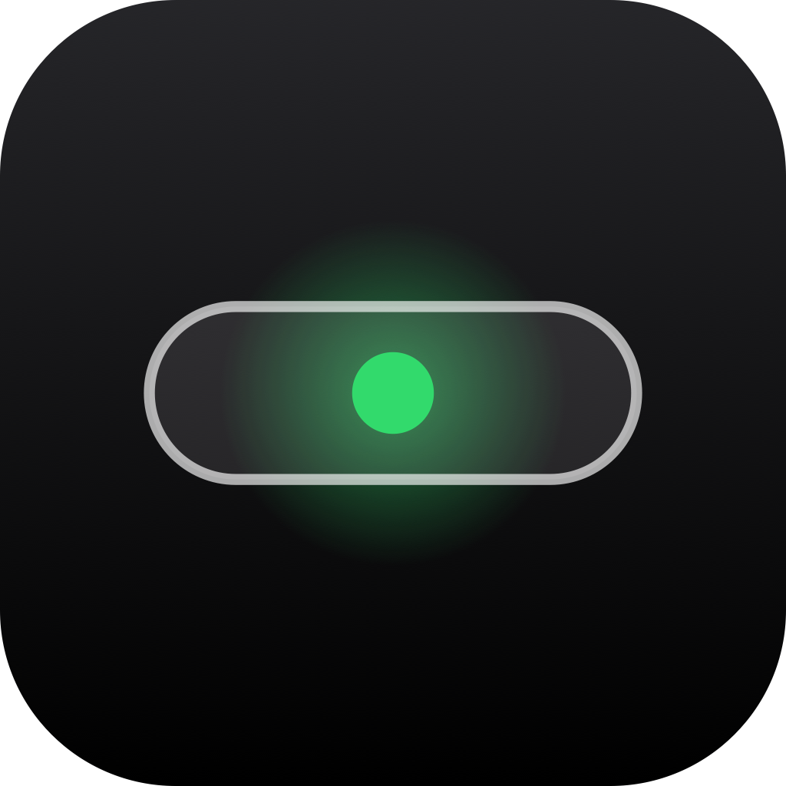

<p align="center">
  <!-- Logo placeholder: add assets/logo.png (512×512) -->
  
</p>

<h1 align="center">Glance</h1>

<p align="center"><b>A configurable, context-aware Live Activity layer for the MacBook notch.</b></p>

<p align="center">
  <a href="#installation">Install</a> ·
  <a href="#why-this-project-exists">Why</a> ·
  <a href="docs/ARCHITECTURE.md">Architecture</a> ·
  <a href="docs/ROADMAP.md">Roadmap</a>
</p>

---

Glance turns the notch into a quiet, intelligent surface that answers three questions:

1. **What am I doing right now?**
2. **What is my Mac doing right now?**
3. **Is there something that needs my attention?**

It is not a Dynamic Island clone, not a notification replacement, and not a dashboard. By default it is just two screens — **Now Playing** and **Pomodoro** — and it stays out of your way. Everything else is opt-in.

## Product Preview

<!-- Screenshot placeholders — no fake screenshots are committed.
     Capture real ones and place them at these paths: -->

| | |
|---|---|
| Now Playing (Minimal) | `assets/screenshots/now-playing-minimal.png` |
| Now Playing (Artwork) | `assets/screenshots/now-playing-artwork.png` |
| Pomodoro | `assets/screenshots/pomodoro.png` |
| Claude Code interruption | `assets/screenshots/claude-interruption.png` |
| Settings — Notch Screens | `assets/screenshots/settings-screens.png` |

## Available Now

**Implemented**

- Notch surface with four states: idle, peek, live, expanded
- Horizontal Screen system — swipe, ⌘←/⌘→, or click the chevrons
- Screen configuration: add, remove, reorder, enable/disable (persisted)
- **Now Playing** for Apple Music and Spotify — Minimal and Artwork appearances, adaptive artwork contrast, crossfading backgrounds, real playback progress
- Optional **System-wide Now Playing** (Experimental) — any app, including browser tabs, via a private Apple framework; off by default, clearly labeled
- **Pomodoro** — focus/break cycles, long breaks, auto-start options, completion interruptions
- Interruption engine: priority preemption, debouncing, expiry, persistent events, return-to-previous-screen
- Optional **Battery & Charging** events (charger, 80%, full, low, critical)
- Optional **Network Activity** (threshold-based throughput, connection lost/restored)
- Optional **Context Awareness** foundation with local history and retention controls
- Optional **Coding Activity** screen (time + current editor)
- **Claude Code integration** via official hooks: needs-input / permission / completed interruptions and an optional status screen
- Privacy: local-first analysis, Never Track list, prompt contents never touch disk
- Multi-display: physical-notch first, compact top-center surface on other displays

**Experimental**

- Artwork-mode contrast tuning on unusual album art
- Coding-context promotion timing

**Planned** (see [docs/ROADMAP.md](docs/ROADMAP.md))

- Universal Activities: local scripts publishing declarative activities ([protocol draft](docs/EXTERNAL_ACTIVITIES.md))
- Project / git-branch detection (opt-in window-title access)
- Sparkle automatic updates
- Screen-sharing-aware redaction of sensitive metadata

## Why This Project Exists

The notch is the one part of the screen that is always visible and never used. Existing notch apps either mirror iOS gimmicks or cram dashboards into it. Glance treats the notch as what it actually is: **a scarce attention surface**. Every activity must earn the right to appear — and by default, almost nothing does.

## Core Product Philosophy

- Quiet when nothing important is happening
- One focused Screen at a time; interruptions are temporary and priority-driven
- Users explicitly choose which screens exist, which providers run, and what may be observed
- Local-first: activity analysis never leaves the Mac
- Technical honesty: no fake states, no invented progress, no pretend integrations

## The Screen System

Screens are persistent, user-configured surfaces arranged horizontally:

```
[ NOW PLAYING ]  [ POMODORO ]  [ CLAUDE ]  [ CODING ]
```

Navigate with a two-finger horizontal swipe, horizontal mouse scroll, ⌘←/⌘→ (while the notch is open), or the chevron controls. The last selected screen is remembered; after 30 minutes closed, Glance returns to the first screen. Details: [docs/SCREEN_SYSTEM.md](docs/SCREEN_SYSTEM.md).

## Notch Interruptions

Glance never intercepts macOS notifications. Interruptions are generated only by Glance's own providers (Pomodoro complete, Claude needs input, battery critical, …), ranked passive → normal → important → urgent, and always return you to the screen you were on. Details: [docs/INTERRUPTION_ENGINE.md](docs/INTERRUPTION_ENGINE.md).

## Now Playing

Two appearances, switchable live in Settings:

- **Minimal** — pure black background that blends into the physical notch; square artwork, title/artist, transport controls, progress.
- **Artwork** — the album art becomes the blurred, translucent background of the whole screen, with an adaptive contrast engine (cached per-artwork analysis) keeping text readable on bright or dark art, and crossfades on track change.

Supported sources: **Apple Music** and **Spotify** via fully public/documented mechanisms. An optional **System-wide Now Playing (Experimental)** toggle adds any other app — Safari, Chrome, VLC, podcasts — using Apple's private, undocumented MediaRemote framework (the same one Control Center uses); it's off by default and Settings says plainly that it could break on a future macOS update. See [docs/NOW_PLAYING.md](docs/NOW_PLAYING.md) for the full honesty notes.

## Pomodoro

Focus · 25:00 · Start. That's the whole interface. Durations, long-break cadence, auto-start, sound, and the completion interruption are configurable in Settings.

## Optional Context Awareness

Off by default. When enabled, Glance classifies broad contexts (coding, meeting, designing, studying, focus, away) from the frontmost app, Pomodoro state, media playback, and idle time — locally. History retention: today / 7 days / 30 days / forever, with one-click clearing. Details: [docs/CONTEXT_ENGINE.md](docs/CONTEXT_ENGINE.md).

## Claude Code Integration

Glance integrates with [Claude Code](https://docs.anthropic.com/en/docs/claude-code) exclusively through its official hooks. A guided installer adds hook entries to `~/.claude/settings.json` (after backing it up); prompt and tool contents are discarded by the hook commands themselves and never reach disk. Glance shows when Claude is working, needs input, needs permission, or completed. Details: [docs/CLAUDE_CODE_INTEGRATION.md](docs/CLAUDE_CODE_INTEGRATION.md).

## Privacy

Your Mac activity is analysed locally. Activity data does not leave this Mac unless an explicitly enabled integration requires external communication (the only case today: Spotify album artwork is fetched from Spotify's image CDN). Full policy: [docs/PRIVACY.md](docs/PRIVACY.md).

## Architecture Overview

```
Providers (NowPlaying · Pomodoro · Battery · Network · Context · Coding · ClaudeCode)
        │  typed state & events
        ▼
Activity Engine ── lifecycle, isolation ──► Interruption Engine ── priority queue
        │                                         │
        ▼                                         ▼
  Screen Store ◄────────── Notch UI (SwiftUI in an AppKit panel)
```

- **GlanceKit** — engines, models, providers; headless and fully unit-tested
- **Glance** — the app: AppKit notch panel + SwiftUI content, Settings window

Deep dive: [docs/ARCHITECTURE.md](docs/ARCHITECTURE.md).

## System Requirements

- macOS 14 Sonoma or later (Apple silicon or Intel)
- A physical notch is not required — Glance falls back to a compact top-center surface

## Installation

**GitHub Releases** (recommended): download `Glance-<version>.dmg` from the releases page, open it, and drag Glance to Applications. Verify with the published SHA-256 checksums.

**Homebrew** (after first tagged release): a cask template is prepared at `packaging/homebrew/glance.rb`; it is published per-release as described in [docs/RELEASING.md](docs/RELEASING.md).

## Build From Source

```bash
git clone <this repository>
cd glance
make app        # builds dist/Glance.app (ad-hoc signed)
open dist/Glance.app
```

## Development Setup

- Full Xcode: `swift build`, `swift test` work directly.
- Command Line Tools only: use `make build` / `make test` — the Makefile adds the search paths Swift Testing needs on CLT-only machines.

## Configuration

All settings live in the Settings window (menu bar ✨ icon → Settings…). They persist as versioned, typed JSON at `~/Library/Application Support/Glance/settings.json` — no scattered UserDefaults keys.

## Testing

```bash
make test    # 90 tests: engines, providers, persistence, normalization
```

Engines are testable without rendering the notch: schedulers and clocks are injected everywhere.

## Distribution & Release Process

Releases are produced by `.github/workflows/release.yml` on `v*` tags: test → build → sign (Developer ID) → notarize → staple → DMG/ZIP → checksums → GitHub Release. Signing and notarization use repository secrets; without them the workflow produces clearly-marked unsigned drafts. Maintainer steps: [docs/RELEASING.md](docs/RELEASING.md).

## Roadmap

See [docs/ROADMAP.md](docs/ROADMAP.md).

## Contributing

See [CONTRIBUTING.md](CONTRIBUTING.md). The bar for adding anything to the notch is intentionally high — read the product philosophy first.

## Security

See [SECURITY.md](SECURITY.md).

## License

MIT — see [LICENSE](LICENSE).

## Acknowledgements

- Apple's public `NSScreen` safe-area APIs, which make honest notch geometry possible
- The Claude Code team for documented, scriptable hooks
- Every notch app that came before and showed what *not* to overdo
